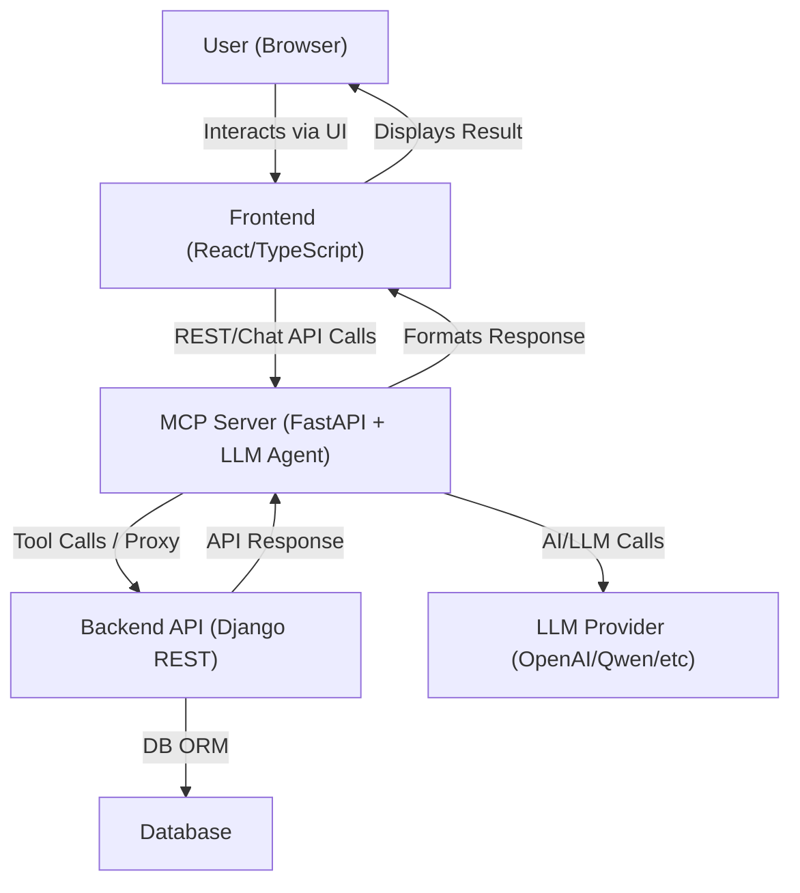
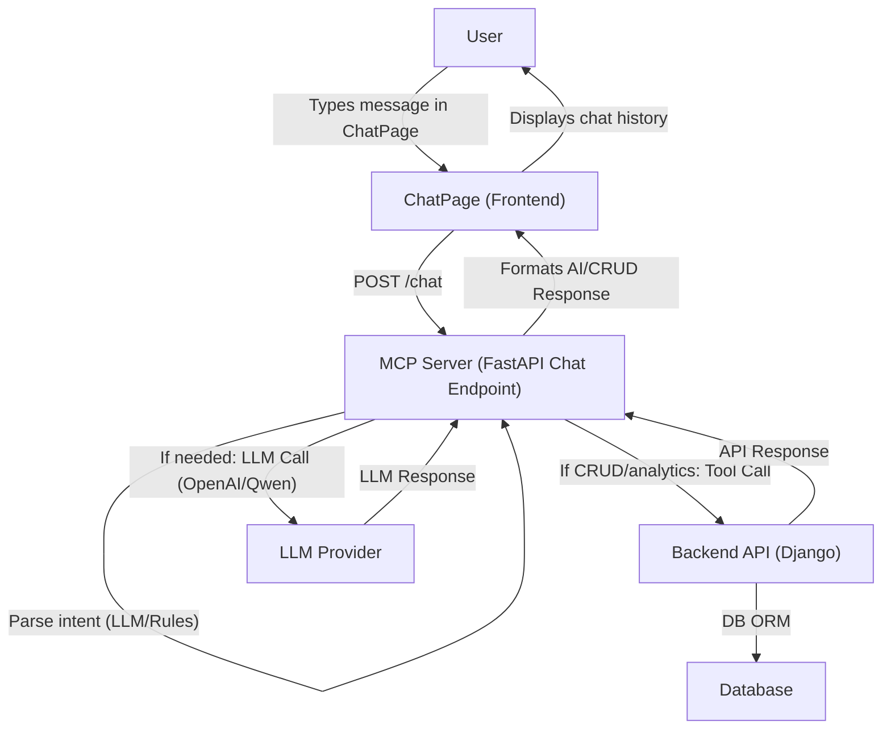
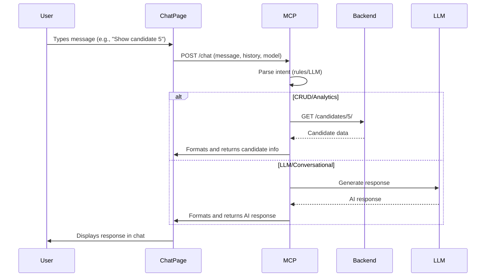
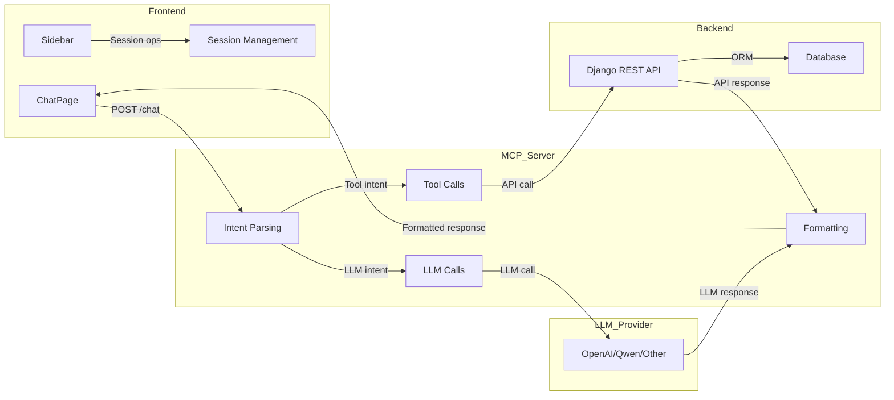

# HR Assistant Pro – Documentation

## Overview

**HR Assistant Pro** is a modern, AI-powered HR management platform that combines a React frontend, a Django REST backend, and an intelligent MCP (Model Context Protocol) server powered by FastAPI and LLMs. It enables conversational HR operations, analytics, and candidate management with both natural language and tool-style commands.

---

## Architecture



- **Frontend:** React/TypeScript (HR/frontend)
- **Backend:** Django REST API (HR/backend)
- **MCP Server:** FastAPI + LLM agent (HR/mcp_server)
- **Database:** Managed by Django ORM (SQLite/PostgreSQL)
- **LLM Provider:** OpenAI, Qwen, or other OpenRouter-compatible models

---

## ChatPage & MCP Server Flow

### Detailed Flowchart



### Step-by-Step Explanation

1. **User (Browser):**
   - Types a message or command in the ChatPage UI.
2. **ChatPage (Frontend):**
   - Sends the message (and chat history, model, etc.) to the MCP server via a POST `/chat` request.
   - Waits for a response to display in the chat history.
3. **MCP Server (FastAPI):**
   - Receives the message and parses the intent using regex rules and/or LLMs.
   - **If the message matches a CRUD or analytics command:**
     - Calls the appropriate tool (e.g., get, update, delete candidate) by making a REST API call to the Django backend.
     - Waits for the backend’s response.
   - **If the message is open-ended or not matched by a rule:**
     - Calls the selected LLM (OpenAI, Qwen, etc.) to generate a response.
   - **If both are needed:**
     - May call a tool, then use the LLM to summarize or explain the result.
   - Formats the response (markdown, suggestions, etc.) and sends it back to the frontend.
4. **Backend API (Django):**
   - Handles CRUD/analytics requests, interacts with the database, and returns results to the MCP server.
5. **LLM Provider:**
   - Handles AI/LLM requests from the MCP server and returns generated text.
6. **ChatPage (Frontend):**
   - Receives the formatted response from the MCP server.
   - Updates the chat history and UI for the user.

### Who Sends What, When, and Why?

- **Frontend → MCP:** Sends user messages, chat history, and selected model to centralize all logic and context.
- **MCP → Backend:** Sends only when a tool/CRUD/analytics action is needed, to keep business logic and data secure and centralized.
- **MCP → LLM:** Sends when a conversational or generative response is needed, or to summarize tool results.
- **Backend → MCP:** Returns structured data (candidates, analytics, etc.) for further formatting or explanation.
- **LLM → MCP:** Returns natural language responses for user-facing explanations or summaries.
- **MCP → Frontend:** Always returns a user-friendly, formatted message (markdown, suggestions, etc.) for display.

**Why this design?**
- Keeps the frontend simple and focused on UI/UX.
- Centralizes all business logic, tool use, and AI in the MCP server for flexibility and security.
- Allows easy extension (add new tools, models, analytics) without changing the frontend.
- Ensures all responses are user-friendly and context-aware.

---

## Sequence Diagram: Typical Chat Interaction



### Architectural Diagram (Component View)



---

## Features

- **Conversational Chatbot:** Natural language and tool-style commands for HR operations.
- **Candidate Management:** Add, update, delete, and list candidates.
- **Bulk Operations:** Bulk delete/update candidates with confirmation.
- **Analytics:** Ask for hiring stats, top sources, and more.
- **Role-Based Access:** Secure endpoints and actions.
- **Session Management:** Rename, delete, and manage chat sessions.
- **Model Switching:** Choose from multiple LLMs for chat and tool use.
- **Confirmation Flows:** Safe, user-friendly confirmations for critical actions.
- **Extensible:** Easily add new tools, analytics, or LLMs.

---

## Setup

### Prerequisites

- Node.js (v18+)
- Python 3.9+
- pip, virtualenv
- (Optional) PostgreSQL for production

### 1. Clone the Repository

```bash
git clone <your-repo-url>
cd MCP
```

### 2. Backend Setup (Django)

```bash
cd HR/backend
python -m venv venv
source venv/bin/activate  # or venv\\Scripts\\activate on Windows
pip install -r requirements.txt
cp .env.example .env  # Edit with your secrets
python manage.py migrate
python manage.py createsuperuser
python manage.py runserver
```

### 3. MCP Server Setup (FastAPI)

```bash
cd ../../mcp_server
pip install -r requirements.txt
cp .env.example .env  # Add your OpenAI/OpenRouter API key
uvicorn main:app --reload
```

### 4. Frontend Setup (React)

```bash
cd ../../frontend
npm install
cp .env.example .env  # Set VITE_API_BASE_URL, etc.
npm run dev
```

---

## Usage

### 1. Login

- Access the frontend at `http://localhost:5173` (or your configured port).
- Login with your credentials.

### 2. Chat & Commands

- Use the chat to ask questions, manage candidates, or request analytics.
- Example commands:
  - “Show candidate 5”
  - “Delete candidate 7”
  - “Update candidate 8 status to Hired”
  - “Delete candidates 5, 6, 7”
  - “How many candidates were hired this month?”
  - “Show me the top sources for successful candidates.”

### 3. Model Selection

- Switch LLMs from the chat header or dropdown below the input field.

### 4. Session Management

- Rename, delete, or create new chat sessions from the sidebar.

### 5. Confirmation Flows

- For delete/update actions, the system will show candidate details and ask for confirmation before proceeding.

---

## Extending the System

### Add a New Tool (Backend)

1. Implement the tool in `HR/mcp_server/tools.py`.
2. Register it in `agent.py` as a new Tool.
3. Add intent extraction logic in `main.py` if needed.

### Add a New Analytics Query

- Update `is_analytics_query` and related logic in `main.py` to support new analytics questions.

### Add a New LLM

- Add the model to the frontend model list and ensure it’s supported by your OpenRouter or LLM provider.

---

## Troubleshooting

- **Renaming sessions not working:** Ensure `session_name` is writable in the serializer and PATCH returns the updated object.
- **No messages in sidebar:** Make sure `latest_message` is included in the session serializer and returned by the backend.
- **Model switching not working:** Ensure the selected model is sent with every chat request and used by the backend agent.
- **Bulk actions not confirming:** Check that confirmation logic and pending actions are correctly implemented in `main.py`.

---

## Security & Best Practices

- Use environment variables for all secrets and API keys.
- Restrict CORS and allowed hosts in production.
- Use HTTPS and secure cookies for authentication.
- Regularly update dependencies and review for vulnerabilities.

---

## Contributing

1. Fork the repo and create a feature branch.
2. Make your changes with clear commit messages.
3. Submit a pull request with a detailed description.

---

## License

MIT (or your chosen license)

---

## Contact

For questions, issues, or contributions, open an issue or contact the maintainer at [your-email@example.com].

---

If you want this as a markdown file, or want to add more sections (API reference, screenshots, etc.), let me know! 